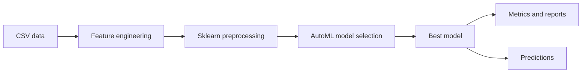
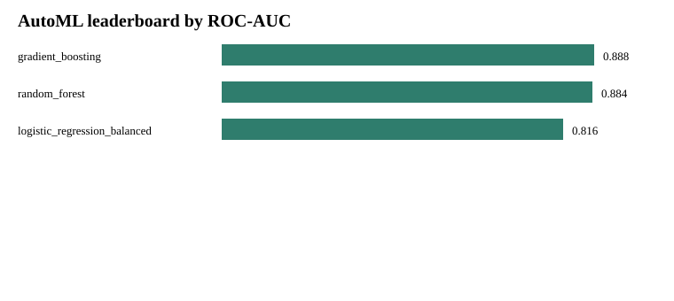
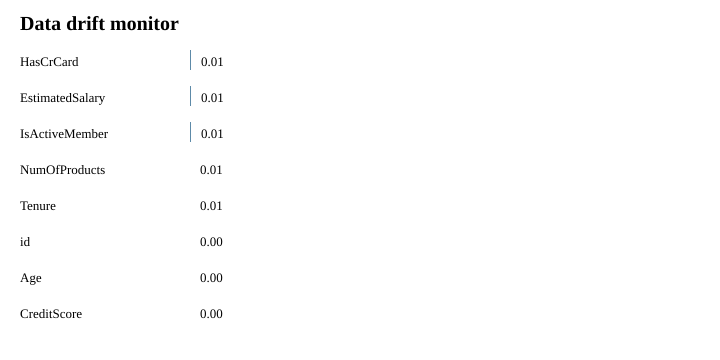

# Алекс Март. Автоматизация ML: прогнозирование оттока клиентов банка

Учебный проект по дисциплине «Автоматизация машинного обучения».

Цель проекта: собрать понятный автоматизированный ML-пайплайн для задачи предсказания оттока клиентов банка.

GitHub: https://github.com/alexmart1997/ML_auto

Источник идеи и данных: предыдущая работа по теме bank churn: https://github.com/alexmart1997/Case_1

## 1. Бизнес-задача

Банк хочет заранее понимать, какие клиенты с высокой вероятностью уйдут. Если клиент попадает в группу риска, банк может предложить персональные условия, связаться с ним через менеджера или запустить удерживающую кампанию.

В проекте решается задача бинарной классификации:

- `Exited = 1`: клиент ушёл;
- `Exited = 0`: клиент остался.

Основная метрика: `ROC-AUC`, потому что важно не только поставить класс, но и хорошо ранжировать клиентов по вероятности оттока.

## 2. Данные

Используются CSV-файлы:

- `data/raw/train.csv`: обучающая выборка, 165034 строки;
- `data/raw/test.csv`: тестовая выборка для инференса, 110023 строки.

Признаки:

- клиентские: `CreditScore`, `Age`, `Tenure`, `EstimatedSalary`;
- банковские: `Balance`, `NumOfProducts`, `HasCrCard`, `IsActiveMember`;
- категориальные: `Geography`, `Gender`;
- технические: `id`, `CustomerId`, `Surname`.

Технические идентификаторы удаляются перед обучением. Дополнительно создаются два простых признака:

- `BalanceToSalary`: отношение баланса к зарплате;
- `TenureByAge`: отношение срока обслуживания к возрасту.

Доля клиентов с оттоком в обучающей выборке: 21.16%.

## 3. Архитектура пайплайна

Проект построен как обычная ML-система:

1. Extract: чтение данных из `data/raw`.
2. Transform: удаление идентификаторов, генерация признаков, масштабирование числовых признаков, one-hot encoding категорий.
3. Train: обучение нескольких моделей.
4. Evaluate: расчёт метрик на валидационной выборке.
5. Load: сохранение модели, метрик, отчёта мониторинга и прогнозов.
6. Monitor: контроль качества модели, дрейфа данных и скорости инференса.



## 4. AutoML

AutoML реализован простым и понятным способом: код автоматически обучает несколько моделей `scikit-learn`, сравнивает их по `ROC-AUC` и сохраняет лучшую.

Используемые модели:

- `LogisticRegression`;
- `RandomForestClassifier`;
- `GradientBoostingClassifier`.

Для препроцессинга используется стандартный `sklearn Pipeline`:

- `FunctionTransformer` для добавления признаков;
- `ColumnTransformer` для раздельной обработки числовых и категориальных колонок;
- `StandardScaler` для числовых признаков;
- `OneHotEncoder` для категориальных признаков.

Лучшая модель: `GradientBoostingClassifier`.

| Метрика | Значение |
|---|---:|
| ROC-AUC | 0.8877 |
| Accuracy | 0.8635 |
| Precision | 0.7583 |
| Recall | 0.5208 |
| F1 | 0.6175 |



## 5. Мониторинг

Мониторинг реализован в `src/bank_churn_automl/monitor.py`.

Проверяются три группы показателей.

Качество модели:

- ROC-AUC;
- F1;
- Recall;
- статус `ok` или `warning`.

Качество данных:

- количество пропусков;
- количество проверенных строк;
- дрейф числовых признаков через сдвиг среднего.

Инфраструктура:

- batch latency;
- rows per second;
- общий статус ресурсов.

Текущий отчёт мониторинга:

- ROC-AUC: 0.8877;
- пропуски: 0;
- предупреждения по дрейфу: 0;
- batch latency: 85.69 ms;
- rows per second: 385202.



## 6. Тестирование

Тесты находятся в папке `tests`.

Проверяется:

- загрузка данных и наличие целевой переменной;
- корректность базовых метрик `sklearn`;
- smoke-тест полного `sklearn Pipeline`.

Запуск:

```bash
pip install -r requirements.txt
pip install -e .
pytest -q
```

Текущий результат: `4 passed`.

## 7. Docker

Контейнер описан в `Dockerfile`.

Используемый базовый образ: `python:3.11-slim`.

Команды:

```bash
docker build -t bank-churn-automl .
docker run --rm bank-churn-automl
```

Что делает контейнер:

- создаёт одинаковую среду запуска;
- устанавливает зависимости;
- копирует код и данные;
- запускает обучение командой `python -m bank_churn_automl.train`.

## 8. CI/CD

CI/CD реализован через GitHub Actions: `.github/workflows/ci.yml`.

Pipeline в GitHub Actions:

1. скачивает репозиторий;
2. устанавливает Python 3.11;
3. устанавливает зависимости;
4. запускает `pytest -q`;
5. запускает обучение;
6. сохраняет отчёты как artifacts.

Git-команды для публикации проекта:

```bash
git status
git add .
git commit -m "Add sklearn automated bank churn pipeline"
git push origin main
```

## 9. Запуск проекта

```bash
pip install -r requirements.txt
pip install -e .
python -m bank_churn_automl.train
python -m bank_churn_automl.predict
```

После запуска создаются:

- `models/best_model.pkl`;
- `reports/metrics.json`;
- `reports/monitoring_report.json`;
- `reports/figures/automl_leaderboard.svg`;
- `reports/figures/monitoring_drift.svg`;
- `reports/predictions.csv`.

## 10. Выводы для бизнеса

Модель показывает `ROC-AUC = 0.8877`, то есть хорошо ранжирует клиентов по риску оттока. Это позволяет банку не обрабатывать всю клиентскую базу одинаково, а сначала работать с клиентами, у которых вероятность ухода выше.

Практический результат: можно сформировать приоритетный список клиентов для удержания, снизить стоимость retention-кампаний и сфокусировать внимание менеджеров на наиболее рискованных клиентах.

## Структура проекта

```text
ML_auto/
├── .github/workflows/ci.yml
├── data/raw/train.csv
├── data/raw/test.csv
├── models/best_model.pkl
├── presentation/bank_churn_automl_presentation.pptx
├── reports/
│   ├── figures/
│   ├── metrics.json
│   └── monitoring_report.json
├── src/bank_churn_automl/
├── tests/
├── Dockerfile
├── pyproject.toml
├── requirements.txt
└── README.md
```
