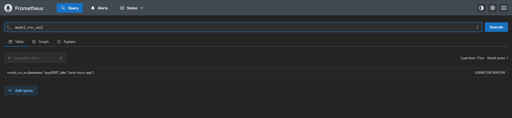
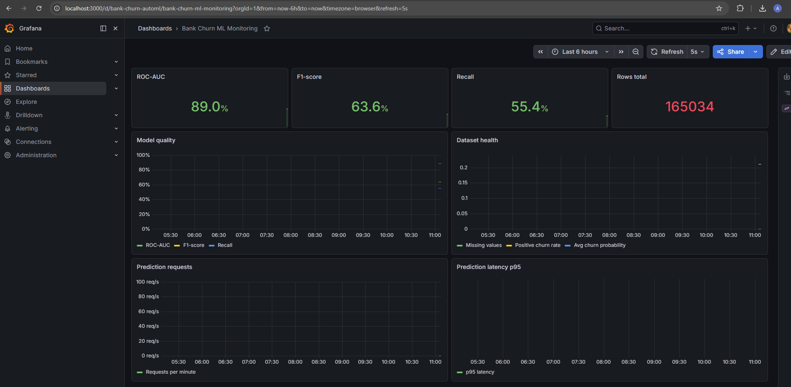

# Отчёт о выполнении проекта

## Тема работы

**Автоматизация ML-пайплайна для прогнозирования оттока клиентов банка**

Проект выполнен на основе старого ноутбука `Case_1.ipynb` и преобразован в полноценный учебный ML-проект, пригодный для размещения на GitHub, запуска локально, проверки через CI и демонстрации мониторинга через Prometheus и Grafana.

## Цель работы

Цель работы — автоматизировать процесс машинного обучения для задачи бинарной классификации:

> предсказать, уйдёт клиент банка или нет.

Целевая переменная:

```text
Exited
```

Интерпретация:

- `Exited = 0` — клиент не ушёл;
- `Exited = 1` — клиент ушёл.

## Используемые данные

Датасет загружается из открытого источника:

```text
https://github.com/alexmart1997/Case_1/blob/main/train.csv?raw=true
```

При первом запуске проекта данные скачиваются автоматически и сохраняются локально:

```text
data/train.csv
```

Это сделано для воспроизводимости: после первой загрузки проект может использовать локальную копию данных.

## Выполненные требования

| Требование | Реализация |
|---|---|
| Простой и понятный код | Проект разбит на небольшие скрипты без сложных классов |
| Комментарии на русском языке | В основных скриптах добавлены русские комментарии |
| Структура под GitHub | Добавлены `src`, `tests`, `data`, `models`, `reports`, `Dockerfile`, `.gitignore`, `README.md` |
| Загрузка данных по ссылке | Реализована в `src/data.py` |
| Сохранение данных локально | Данные сохраняются в `data/train.csv` |
| Train/test split | Используется `train_test_split` со `stratify=y` |
| Целевая переменная `Exited` | Используется во всём пайплайне |
| Удаление `id`, `CustomerId`, `Surname` | Реализовано перед обучением и предсказанием |
| Preprocessing | Реализован через `ColumnTransformer` |
| Обучение нескольких моделей | Logistic Regression, Random Forest, HistGradientBoosting |
| Выбор лучшей модели | По метрике ROC-AUC |
| Сохранение модели | `models/best_model.pkl` |
| Сохранение метрик | `reports/metrics.csv` |
| Оценка модели | `src/evaluate.py` |
| Инференс | `src/predict.py` |
| MLflow | Логирование параметров, метрик и артефактов |
| Мониторинг | Локальный мониторинг и FastAPI `/metrics` |
| Prometheus и Grafana | Реализованы через `docker-compose.yml` |
| Тесты | Добавлены pytest-тесты |
| CI | Добавлен GitHub Actions workflow |

## Структура проекта

```text
ML_auto/
  data/
    .gitkeep
  models/
    .gitkeep
  reports/
    .gitkeep
  src/
    __init__.py
    config.py
    data.py
    features.py
    train.py
    evaluate.py
    predict.py
    monitoring.py
    monitoring_app.py
  tests/
    conftest.py
    test_data.py
    test_features.py
  monitoring/
    prometheus.yml
    grafana/
      dashboards/
        bank_churn_dashboard.json
      provisioning/
        datasources/
          prometheus.yml
        dashboards/
          dashboards.yml
  docs/
    images/
      grafana.png
      prometheus.png
  .github/
    workflows/
      ci.yml
  Dockerfile
  docker-compose.yml
  requirements.txt
  README.md
  REPORT.md
```

## Описание основных файлов

### `src/config.py`

Файл содержит общие настройки проекта:

- пути к папкам;
- путь к данным;
- путь к модели;
- путь к метрикам;
- имя целевой переменной;
- список технических колонок;
- параметры разбиения train/test.

Пример:

```python
TARGET_COLUMN = "Exited"
DROP_COLUMNS = ["id", "CustomerId", "Surname"]
TEST_SIZE = 0.2
RANDOM_STATE = 42
```

Такой подход позволяет хранить настройки централизованно и не дублировать их в разных скриптах.

### `src/data.py`

Скрипт отвечает за загрузку и подготовку данных.

Основные функции:

- `load_data()` — загружает датасет;
- `split_features_target()` — отделяет признаки от целевой переменной;
- `make_train_test_split()` — делает train/test split.

Особенность:

```python
stratify=y
```

используется для сохранения баланса классов в train и test выборках.

### `src/features.py`

В этом файле описан preprocessing.

Числовые признаки:

```text
CreditScore
Age
Tenure
Balance
NumOfProducts
HasCrCard
IsActiveMember
EstimatedSalary
```

Категориальные признаки:

```text
Geography
Gender
```

Для числовых признаков применяется:

```text
SimpleImputer(strategy="median") + StandardScaler
```

Для категориальных признаков применяется:

```text
SimpleImputer(strategy="most_frequent") + OneHotEncoder(handle_unknown="ignore")
```

Preprocessing собран через `ColumnTransformer`, что позволяет по-разному обрабатывать числовые и категориальные признаки.

### `src/train.py`

Главный скрипт обучения.

Запуск:

```bash
python src/train.py
```

В скрипте автоматически обучаются три модели:

- `LogisticRegression`;
- `RandomForestClassifier`;
- `HistGradientBoostingClassifier`.

Для каждой модели создаётся `Pipeline`:

```text
preprocessor + model
```

Это важно, потому что вместе с моделью сохраняется и вся логика подготовки признаков.

Для каждой модели считаются метрики:

- accuracy;
- precision;
- recall;
- f1;
- roc_auc.

Лучшая модель выбирается по `ROC-AUC`.

Результаты сохраняются:

```text
models/best_model.pkl
reports/metrics.csv
```

### `src/evaluate.py`

Скрипт загружает сохранённую модель и оценивает её на test-выборке.

Запуск:

```bash
python src/evaluate.py
```

Сохраняемые результаты:

```text
reports/classification_report.txt
reports/confusion_matrix.png
reports/roc_curve.png
```

### `src/predict.py`

Скрипт используется для инференса по CSV-файлу.

Пример запуска:

```bash
python src/predict.py data/train.csv
```

Перед предсказанием удаляются лишние колонки:

```text
id
CustomerId
Surname
Exited
```

Результат сохраняется:

```text
reports/predictions.csv
```

В файл добавляются колонки:

```text
predicted_class
churn_probability
```

### `src/monitoring.py`

Скрипт выполняет простой локальный мониторинг без внешних сервисов.

Запуск:

```bash
python src/monitoring.py
```

Он проверяет:

- количество строк и колонок;
- долю пропусков;
- наличие нужных признаков;
- распределение целевой переменной `Exited`;
- ROC-AUC, F1 и Recall модели.

Результаты сохраняются:

```text
reports/monitoring_report.txt
reports/target_distribution.png
reports/churn_probability_distribution.png
reports/missing_values.png
```

### `src/monitoring_app.py`

Это FastAPI-приложение, которое отдаёт ML-метрики в формате Prometheus.

Основные endpoint-ы:

```text
http://localhost:8000
http://localhost:8000/health
http://localhost:8000/metrics
http://localhost:8000/predict
```

Endpoint `/metrics` используется Prometheus для сбора метрик.

## MLflow

В проект добавлен MLflow для отслеживания экспериментов.

В `src/train.py` задаётся локальный tracking:

```python
mlflow.set_tracking_uri("mlruns")
mlflow.set_experiment("bank_churn_automl")
```

Для каждой модели логируются:

- название модели;
- параметры модели;
- accuracy;
- precision;
- recall;
- f1;
- roc_auc;
- файл `reports/metrics.csv`;
- лучшая модель как artifact.

MLflow позволяет сравнивать эксперименты и видеть, какая модель дала лучший результат.

Запуск MLflow UI:

```bash
mlflow ui
```

Адрес:

```text
http://127.0.0.1:5000
```

## Prometheus и Grafana

Для демонстрации мониторинга был добавлен стек:

```text
FastAPI app + Prometheus + Grafana
```

Запуск:

```bash
docker compose up --build
```

После запуска доступны:

```text
ML-сервис:  http://localhost:8000
Prometheus: http://localhost:9090
Grafana:    http://localhost:3000
```

Логин и пароль Grafana:

```text
admin / admin
```

## Метрики Prometheus

FastAPI-сервис отдаёт следующие метрики:

```text
model_roc_auc
model_f1_score
model_recall_score
dataset_rows_total
dataset_missing_values_total
churn_positive_rate
prediction_requests_total
prediction_latency_seconds
avg_churn_probability
```

Пример проверки метрики в Prometheus:

```text
model_roc_auc
```

На скриншоте видно, что Prometheus успешно получил метрику `model_roc_auc` от ML-сервиса.



## Grafana dashboard

Для Grafana создан готовый dashboard:

```text
Bank Churn ML Monitoring
```

Dashboard автоматически подключается через provisioning.

В Grafana отображаются:

- ROC-AUC;
- F1-score;
- Recall;
- количество строк в датасете;
- состояние датасета;
- количество prediction-запросов;
- p95 latency предсказаний.

На скриншоте видно, что Grafana получает данные из Prometheus и отображает ML-метрики модели.



## Docker

Для контейнеризации создан `Dockerfile`.

Базовый образ:

```text
python:3.11-slim
```

Команда по умолчанию:

```bash
python src/train.py
```

Для запуска всей monitoring-инфраструктуры используется `docker-compose.yml`.

Сервисы:

- `app` — FastAPI ML-сервис;
- `prometheus` — сбор метрик;
- `grafana` — визуализация метрик.

Запуск:

```bash
docker compose up --build
```

Остановка:

```bash
docker compose down
```

## GitHub Actions CI

В проект добавлен CI pipeline:

```text
.github/workflows/ci.yml
```

Pipeline запускается при:

- `push`;
- `pull_request`.

Шаги CI:

1. Checkout репозитория.
2. Установка Python 3.11.
3. Установка зависимостей из `requirements.txt`.
4. Запуск тестов.
5. Запуск обучения модели.
6. Запуск оценки модели.

Основные команды CI:

```bash
python -m pytest
python src/train.py
python src/evaluate.py
```

CI нужен для того, чтобы автоматически проверять, что проект не сломан после изменений.

## Тестирование

В проект добавлены pytest-тесты:

```text
tests/test_data.py
tests/test_features.py
```

Проверяется:

- данные загружаются и не пустые;
- в данных есть `Exited`;
- после удаления лишних колонок нет `id`, `CustomerId`, `Surname`;
- `build_preprocessor()` создаётся без ошибок;
- train/test split возвращает непустые выборки.

Запуск тестов:

```bash
python -m pytest
```

## Инструкция по запуску проекта

### 1. Установка зависимостей

```bash
python -m venv .venv
```

Windows PowerShell:

```powershell
.\.venv\Scripts\activate
```

Установка зависимостей:

```bash
pip install -r requirements.txt
```

### 2. Обучение модели

```bash
python src/train.py
```

### 3. Оценка модели

```bash
python src/evaluate.py
```

### 4. Инференс

```bash
python src/predict.py data/train.csv
```

### 5. Локальный мониторинг

```bash
python src/monitoring.py
```

### 6. Prometheus и Grafana

```bash
docker compose up --build
```

Открыть:

```text
http://localhost:9090
http://localhost:3000
```

## Полученные результаты

По итогам обучения лучшей моделью стала:

```text
HistGradientBoostingClassifier
```

Качество модели:

```text
ROC-AUC: 0.8897
F1-score: 0.6361
Recall: 0.5540
```

Количество строк в датасете:

```text
165034
```

Эти значения также отображаются в Grafana dashboard.

## Вывод

В ходе работы старый ноутбук был преобразован в автоматизированный ML-проект.

Были реализованы:

- загрузка и подготовка данных;
- preprocessing;
- обучение нескольких моделей;
- автоматический выбор лучшей модели;
- сохранение модели и метрик;
- оценка качества;
- инференс;
- MLflow tracking;
- мониторинг качества данных и модели;
- FastAPI-сервис;
- Prometheus-метрики;
- Grafana dashboard;
- Docker Compose;
- GitHub Actions CI.

Проект соответствует требованиям учебного задания и демонстрирует полный цикл автоматизации машинного обучения: от данных и обучения модели до мониторинга и проверки через CI.
